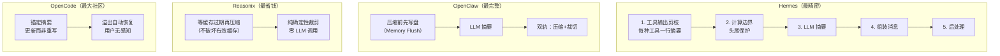

# 上下文压缩 — 总览

> 四个主流 AI Agent 怎么在对话越来越长时，把旧信息"压缩"成摘要，不丢关键上下文。

---

## 一句话

**上下文压缩 = 对话太长放不下 → 把已经干完的事总结成一段摘要 → 腾出空间继续干活。**

---

## 四个系统怎么做的（一张图）

---

## 四系统核心差异（一张表）

| 系统 | 触发时机 | 核心手段 | 最独特的设计 |
|------|---------|---------|------------|
| **Hermes** | Token 阈值 + 反抖动 | 5 阶段流水线 | 每种工具一行智能摘要（零 LLM） |
| **OpenClaw** | 溢出恢复/阈值/文件守卫 | LLM 摘要 + 独立裁切 | **压缩前内存冲刷**（先写盘再压） |
| **Reasonix** | 缓存过期时 | 确定性裁剪 | **缓存经济学驱动**——只在缓存过期才动 |
| **OpenCode** | 硬编码 75% | 锚定摘要更新 | auto-replay：溢出后自动恢复对话 |

---

## 快速导航

| 你想看什么 | 去哪个文件 |
|-----------|-----------|
| Hermes 压缩怎么一步步做的 | [`01-Hermes压缩流程.md`](./01-Hermes压缩流程.md) |
| 四个系统挨个对比 | [`02-四系统对比.md`](./02-四系统对比.md) |
| 哪些设计可以借鉴复用 | [`03-可复用设计模式.md`](./03-可复用设计模式.md) |

---

## 一句话记住四个系统

> **Hermes** 剪得最精细 · **OpenClaw** 保护最周全 · **Reasonix** 算得最精明 · **OpenCode** 恢复最丝滑
