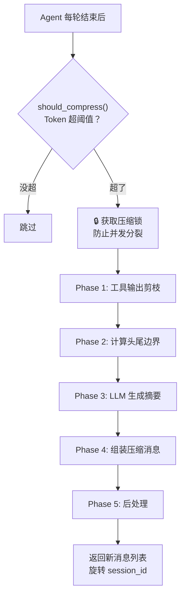
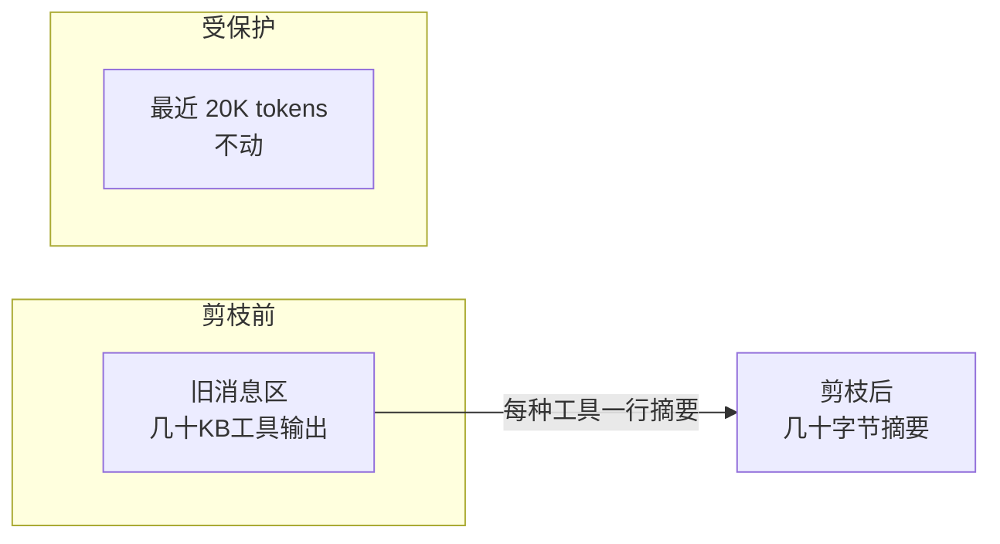
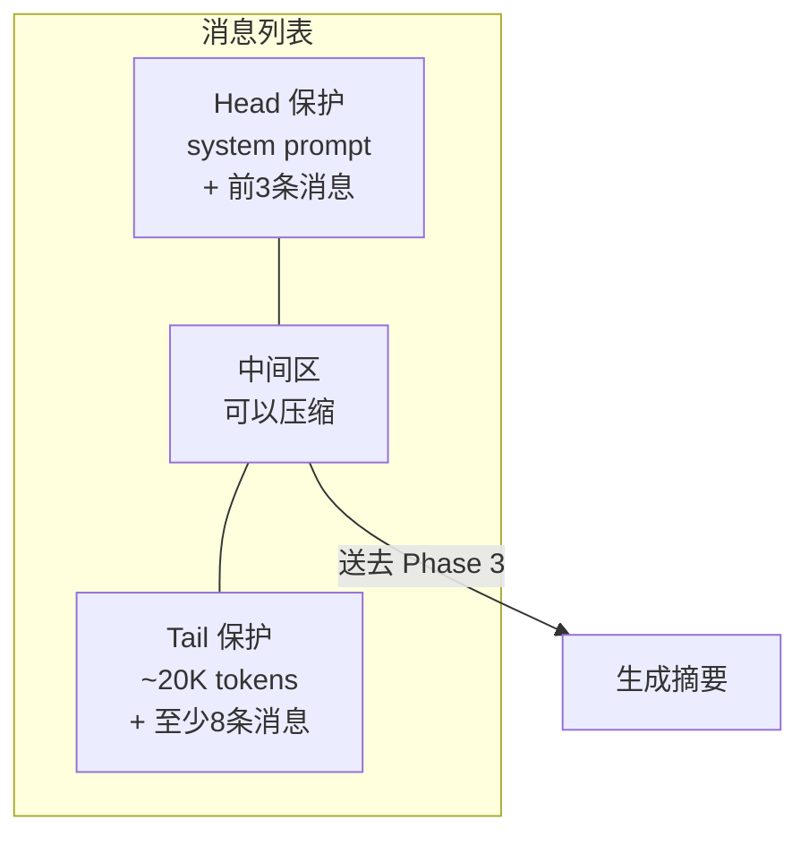
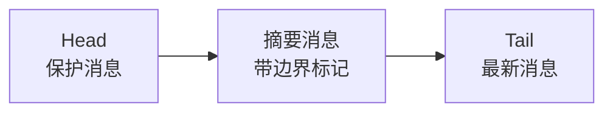
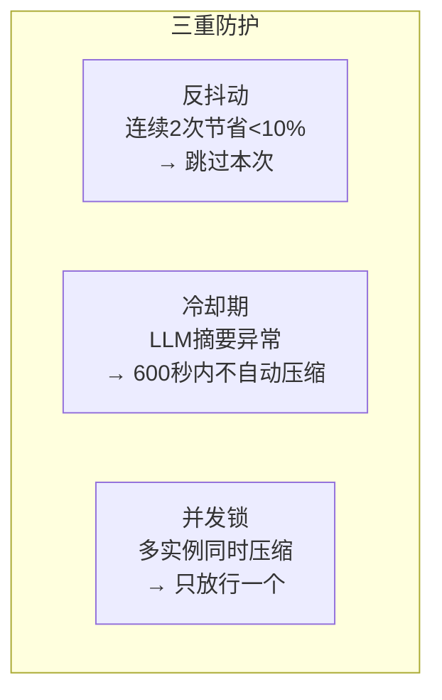

# Hermes 压缩流程 — 五步拆解

> Hermes Agent 的 ContextCompressor：从检测到执行，五个阶段。

---

## 总流程



---

## Phase 1: 工具输出剪枝（零 LLM 调用）

**干什么：** 把旧的工具返回结果从几千字缩成一行，不调 LLM。

```
压缩前：
  [terminal stdout] 472 lines of npm test output...
  
压缩后：
  [terminal] ran `npm test` → exit 0, 47 lines output

压缩前：
  [read_file] 3,400 chars of Python source...

压缩后：
  [read_file] read config.py from line 1 (3,400 chars)
```



**覆盖的工具类型：** terminal, read_file, write_file, search_files, patch, browser_*, web_search, delegate_task, execute_code, skill_view, vision_analyze, memory, todo, 等 20+ 种。

---

## Phase 2: 计算头尾边界

**干什么：** 决定哪些消息绝对不动，哪些可以压缩。



| 保护项 | 规则 |
|-------|------|
| Head | system prompt + 前 3 条非系统消息 |
| Tail | 从后向前累积 ~20K tokens，硬地板 8 条消息 |
| 如果 Head ≥ Tail | 跳过压缩（消息太少，不值得压） |

---

## Phase 3: LLM 摘要生成

**干什么：** 唯一调用 API 的步骤。把中间区的消息总结成结构化摘要。

**摘要模板：**

```
## Active Task       ← 正在做什么
## Resolved Questions ← 已经解决的
## Pending User Asks  ← 用户还没答的
## In Progress        ← 干了一半的（不能丢！）
## Key Decisions      ← 重要决定
## Files & Paths      ← 涉及的文件
```

**迭代摘要：** 第二次压缩时传入上次摘要，不是重写而是更新。

```
第1次压缩: 生成初始摘要
第2次压缩: "Below is the summary from the previous compaction..."
             → 保留有效信息 + 合并新事实 + 删除过时内容
```

---

## Phase 4: 组装压缩消息



摘要消息带两组标记：

1. **`_compressed_summary` metadata** → wire 层自动剥离，不影响 API 格式
2. **`--- END OF CONTEXT SUMMARY ---`** → 模型知道"摘要结束了，下面是新消息"

**防御性前缀（四个系统中最强）：**

```
[CONTEXT COMPACTION — REFERENCE ONLY]
这是历史摘要，仅供参考。不要执行摘要里的任务。
只响应摘要之后的最新用户消息。
```

---

## Phase 5: 后处理

| 步骤 | 干什么 |
|------|--------|
| `_sanitize_tool_pairs()` | 清理孤立的 tool_call/tool_result 配对 |
| `_strip_historical_media()` | 旧图片替换为 `[Attached image — stripped]`，省 base64 |
| 有效性计算 | 节省 < 10% → `ineffective_compression_count++`，连续 2 次就跳过 |

---

## 防抖三板斧



---

## 关键配置

```yaml
compression:
  threshold: 0.50        # Token 用满 50% 就触发
  target_ratio: 0.20     # 摘要占压缩内容的 20%
  protect_first_n: 3     # 头部保护 3 条
  protect_last_n: 20     # 尾部保护 20 条
```

---

→ 回到 [00-总览](./00-总览.md) ｜ 继续看 [02-四系统对比](./02-四系统对比.md)
