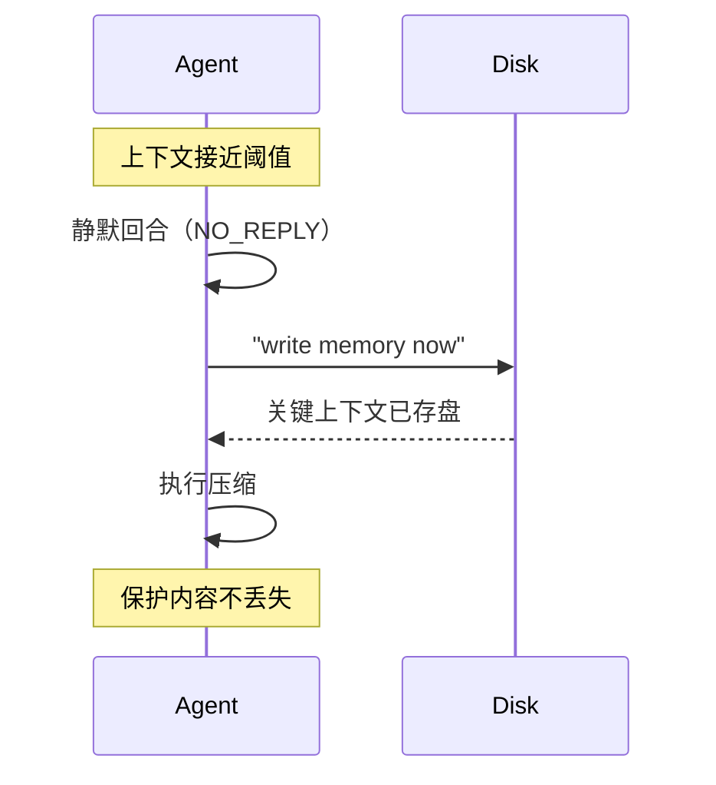

# 四系统对比 — 谁在哪方面最强

> OpenCode · Reasonix · OpenClaw · Hermes Agent 压缩机制横向对比

---

## 一句话记住四个

| 系统 | 一句话 |
|------|--------|
| **Hermes** | 每种工具一行智能摘要，剪得最精细 |
| **OpenClaw** | 压缩前先写盘，保护最周全 |
| **Reasonix** | 等缓存过期再动，算得最精明 |
| **OpenCode** | 溢出后自动恢复对话，恢复最丝滑 |

---

## 全维度对比


| 维度 | OpenCode | Reasonix | OpenClaw | Hermes |
|------|----------|----------|----------|--------|
| **触发** | 硬编码 75% | 缓存 TTL 感知 | 溢出+阈值+文件守卫 | 可配阈值+反抖动 |
| **预压缩** | — | stale 工具裁剪 | **内存冲刷回合** | 工具输出剪枝 |
| **摘要模型** | 独立模型 | 独立模型 | 独立+可插拔 | 独立 aux+fallback |
| **迭代** | ✅ 锚定更新 | ✅ | ✅ 重新蒸馏 | ✅ 传上次摘要 |
| **防抖** | — | — | 溢出重试 | **三重：反抖+冷却+锁** |
| **失败** | fallback | 机械折叠 | default/safeguard | abort or static |
| **配对保护** | — | — | ✅ | ✅ |
| **可插拔** | 插件钩子 | 编译时 | ✅ provider | ✅ ABC 接口 |
| **手动** | `/compact` | `/compact` | `/compact [focus]` | `/compress [force]` |
| **剪枝** | timestamp 标记 | 确定性 placeholder | 独立 pruning | **每种工具一行摘要** |

---

## 每个系统最独特的设计

### Hermes — 工具输出剪枝

```
[terminal] ran `npm test` → exit 0, 47 lines output
[read_file] read config.py from line 1 (3,400 chars)
[browser_navigate] https://example.com (45,000 chars)
```

> 20+ 种工具每种一行智能摘要，零 LLM 调用。

### OpenClaw — 压缩前内存冲刷



> 四个系统中唯一在压缩前主动触发 Agent 写盘的。

### Reasonix — 缓存经济学

```
缓存命中 → 比未命中便宜 50-120 倍
所以 cacheColdAfter = 24h → 宁可错过一次无额外成本压缩
                            也不破坏有效缓存
```

> 不是"什么时候压缩最合理"，而是 **"什么时候压缩最便宜"**。

### OpenCode — 溢出自动恢复

```
LLM 返回 "context too long"
  → 向上找到引发溢出的用户消息
  → 截断历史
  → 压缩后创建新消息："Continue if you have next steps..."
  → 用户完全无感知
```

---

## 特色能力交叉矩阵

| 能力 | OpenCode | Reasonix | OpenClaw | Hermes |
|------|:---:|:---:|:---:|:---:|
| LLM 摘要 | ✅ | ✅ | ✅ | ✅ |
| 工具输出剪枝 | ⚠️ 标记 | ✅ placeholder | ✅ 独立系统 | ✅ **智能摘要** |
| 压缩前内存冲刷 | ❌ | ❌ | ✅ | ❌ |
| 溢出自动恢复 | ✅ auto-replay | ❌ | ✅ retry | ✅ retry |
| 冷恢复压缩 | ❌ | ✅ | ❌ | ❌ |
| 缓存经济学 | ❌ | ✅ | ❌ | ❌ |
| 防抖机制 | ❌ | ❌ | ❌ | ✅ **三重** |
| 图片处理 | ⚠️ | ❌ | ❌ | ✅ |
| 可插拔接口 | ⚠️ hooks | ❌ | ✅ provider | ✅ ABC |
| 防御性前缀 | ❌ | ❌ | ❌ | ✅ |
| successor 机制 | ❌ | 原子快照 | ✅ | session 旋转 |
| mid-turn 压缩 | ❌ | ❌ | ✅ opt-in | ❌ |

---

→ 回到 [00-总览](./00-总览.md) ｜ 继续看 [03-可复用设计模式](./03-可复用设计模式.md)
