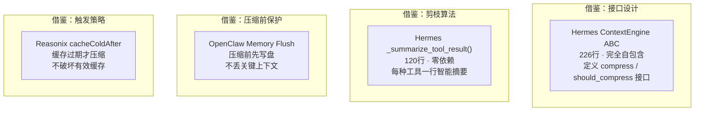
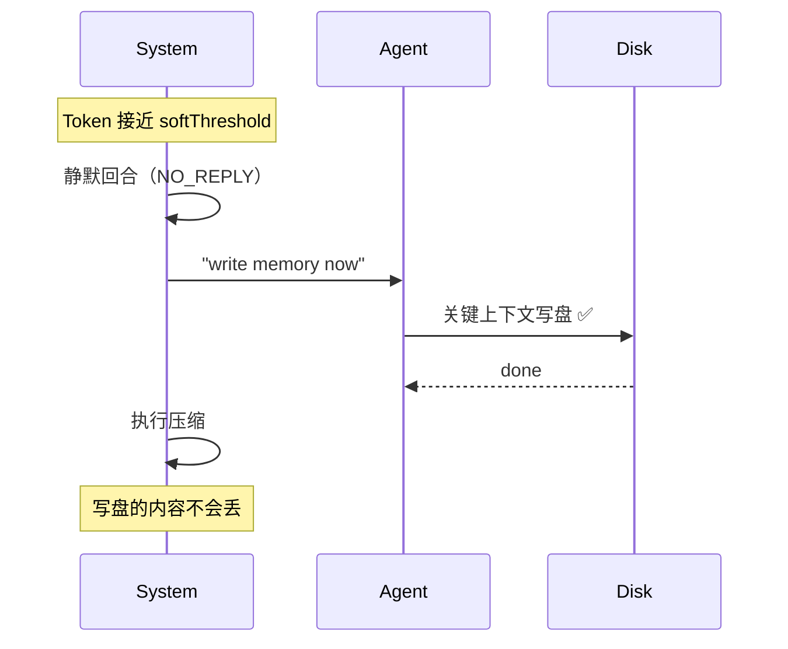

# 可复用设计模式 — 从哪借鉴什么

> 如果你要自己做压缩引擎，从四个系统各借鉴一项最值的东西。

---

## 一张图：四项可借鉴的东西



---

## 1. 可插拔接口 — 借鉴自 Hermes

```python
class ContextEngine(ABC):
    """226行，无外部依赖。定义压缩引擎的标准接口。"""
    
    def should_compress(self, prompt_tokens: int) -> bool:
        """判断是否该触发压缩"""
        
    def compress(self, messages, current_tokens, focus_topic) -> list:
        """主算法入口，返回压缩后的消息列表"""
        
    def update_from_response(self, usage):
        """每次 API 调用后更新 token 计数"""
```

**借鉴理由：** 完全自包含的 ABC，换个引擎只要实现这个接口。OpenCode 没抽象，Reasonix 编译时注册，只有 Hermes 和 OpenClaw 提供了真正的可插拔接口——其中 Hermes 的更干净。

---

## 2. 工具输出智能摘要 — 借鉴自 Hermes

```python
def _summarize_tool_result(tool_name, content) -> str:
    """120行，零 LLM 调用，纯 stdlib"""
    
    if tool_name == "terminal":
        return f"[terminal] ran `{cmd}` → exit {code}, {lines} lines"
    
    if tool_name == "read_file":
        return f"[read_file] read {path} from line {start} ({len} chars)"
    
    # ... 20+ 种工具各有专属摘要器
```

**借鉴理由：** 零 API 调用、信息不丢、每种工具有专属的摘要格式。这是 Phase 1 的核心，独立于整个压缩流水线，可以直接拿出来用。

---

## 3. 压缩前内存冲刷 — 借鉴自 OpenClaw



**借鉴理由：** 四个系统中唯一在压缩前主动保护记忆的。Hermes 有 `on_pre_compress()` 回调但只是通知，不触发实际写盘。这个模式确保"压完不会忘"。

---

## 4. 缓存经济学触发 — 借鉴自 Reasonix

```go
// 不是"token 超了就压"
// 而是"缓存过期才压——此时压缩零额外代价"

if session.Idle > cacheColdAfter {
    prune()  // 缓存已过期，重写历史免费
} else {
    // 缓存仍有效，别动！
}
```

**借鉴理由：** 缓存命中比未命中便宜 50-120 倍。在错误的时间压缩 = 使有效缓存失效 = 下一轮付全价。Reasonix 的 `cacheColdAfter=24h` 是风险不对称设计：宁可错过一次无额外成本压缩，也不使缓存失效。

---

## 5. 锚定迭代摘要 — 借鉴自 OpenCode

```
不是"生成新摘要"
而是"更新已有摘要"

第1次: 生成初始锚定摘要
第2次: 保留有效内容 + 合并新事实 + 删除过时项
第3次: 同上
```

**借鉴理由：** 重写摘要容易丢信息。"锚定更新"保留渐进结构，对长会话（多次压缩）尤为重要。

---

## 6. 防抖三板斧 — 借鉴自 Hermes

| 机制 | 干什么 |
|------|--------|
| 反抖动 | 连续 2 次节省 < 10% → 跳过，别压了 |
| 冷却期 | LLM 摘要抛异常 → 600 秒内不再试 |
| 并发锁 | 多实例同时压缩 → 只放行一个 |

**借鉴理由：** 防止压缩进入无限循环——OpenCode 和 Reasonix 都没有防抖，OpenClaw 只有溢出重试。

---

## 借鉴的优先级


| 优先级 | 借鉴什么 | 从哪 | 理由 |
|--------|--------|------|------|
| 🥇 | ContextEngine ABC + 工具摘要 | Hermes | 最干净的抽象 + 最精巧的本地优化 |
| 🥈 | Memory Flush + cacheColdAfter | OpenClaw + Reasonix | 保护关键上下文 + 不使缓存失效 |
| 🥉 | 锚定摘要 + 三重防抖 | OpenCode + Hermes | 迭代不丢信息 + 生产级鲁棒 |

---

→ 回到 [00-总览](./00-总览.md)
