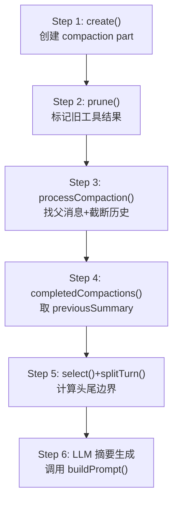
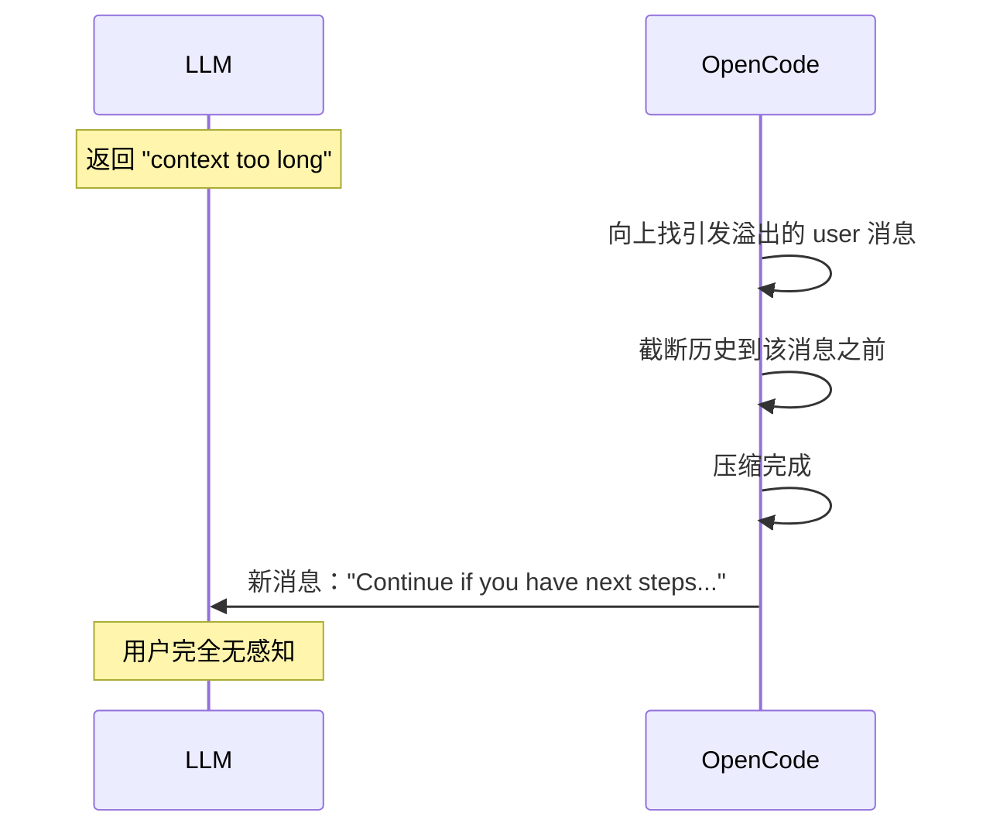

# OpenCode 源码分析

> anomalyco/opencode · 181K⭐ · TypeScript

---

## 核心文件

| 文件 | 作用 |
|------|------|
| `packages/opencode/src/session/compaction.ts` (630行) | 压缩主逻辑 |
| `packages/opencode/src/agent/prompt/compaction.txt` (9行) | 摘要 prompt 模板 |
| `packages/opencode/src/session/overflow.ts` | 溢出检测 |

---

## 触发机制

**硬编码 75% 阈值**——通过 `isOverflow()` 函数判断：

```typescript
// compaction.ts: 概念级
function isOverflow(input: { tokens, model }) {
  return overflow({ cfg, tokens: input.tokens, model: input.model })
}
```

实际溢出定义在 `overflow.ts` 中：
- `contextWindow` = 模型上下文窗口
- `reserveTokens` = 预留空间
- 触发条件：`contextTokens > contextWindow - reserveTokens`

社区 issue #11314 明确要求可配置化，但目前仍是硬编码。

---

## 压缩流程（6步）



### 各步骤细节

**Step 1: create()**
创建 compaction part → 标记消息为 "compaction" 类型。auto → auto=true 标签，overflow → overflow=true 标签。

**Step 2: prune()（预压缩瘦身）**
从消息末尾向前扫描。保护最近 2 个 turn 的工具结果。跳过受保护工具（`PRUNE_PROTECTED_TOOLS = ["skill"]`）。阈值：`PRUNE_PROTECT=40K, PRUNE_MINIMUM=20K` tokens。

**Step 3: processCompaction()**
找到父消息（user message with compaction part）。如果是 overflow → 向前找上一个非 compaction user 消息，截断历史。

**Step 4: completedCompactions()**
遍历历史消息，找到所有已完成的 compaction。提取 previousSummary。

**Step 5: select() + splitTurn()**
`select()`: 按 tail_turns(默认2) 从后向前累积 token 预算。预算 = `preserve_recent_tokens`（默认 min(8000, max(2000, usable×25%))）。
`splitTurn()`: 如果最后一个 turn 太大放不进预算 → 向前切分。

---

## 摘要 Prompt 模板

```text
You are an anchored context summarization assistant for coding sessions.

Summarize only the conversation history you are given. The newest turns
may be kept verbatim outside your summary, so focus on the older context
that still matters for continuing the work.

If the prompt includes a <previous-summary> block, treat it as the
current anchored summary. Update it with the new history by preserving
still-true details, removing stale details, and merging in new facts.

Always follow the exact output structure requested by the user prompt.
Keep every section, preserve exact file paths and identifiers when known,
and prefer terse bullets over paragraphs.

Do not answer the conversation itself. Do not mention that you are
summarizing, compacting, or merging context.
```

**关键设计：** "anchored summary"——不是从头生成摘要，而是**更新**已有锚定摘要。保留仍然有效的信息，删除过时细节，合并新事实。

---

## 结构化摘要模板

```
## Goal
- [single-sentence task summary]

## Constraints & Preferences
- [user constraints, preferences, specs]

## Progress
### Done
### In Progress
### Blocked

## Key Decisions

## Next Steps

## Critical Context
- [important technical facts, errors, open questions]

## Relevant Files
- [file or directory path: why it matters]
```

---

## Overflow 自动恢复

当压缩由 overflow 触发时，OpenCode 有独特的 **auto-replay** 机制：



1. 向上找到引发 overflow 的**上一个**普通 user 消息
2. 截断历史到该消息之前
3. 压缩完成后 → 重用该 user 消息的 parts/agent/model/system
4. 创建新 user 消息标记 `metadata: { compaction_continue: true }`

---

## 独特亮点

1. **anchored summary 模式** — 不重新生成，而是"更新锚定摘要"
2. **auto-replay** — overflow 后自动恢复对话，用户无感知
3. **session compaction 标记位** — `part.state.time.compacted = Date.now()`，用时间戳标记而非删除
4. **插件钩子** — `experimental.session.compacting` / `experimental.compaction.autocontinue`

---

## 源码索引

| 文件 | Commit | 关键函数 | 行号 |
|------|--------|---------|------|
| [compaction.ts](https://github.com/anomalyco/opencode/blob/51e310c9/packages/opencode/src/session/compaction.ts) | `51e310c9` | 全文件 | 1-630 |
| 同上 | 同上 | `SUMMARY_TEMPLATE` | [L115](https://github.com/anomalyco/opencode/blob/51e310c9/packages/opencode/src/session/compaction.ts#L115) |
| 同上 | 同上 | `PRUNE_MINIMUM`/`PRUNE_PROTECT` | [L65-L66](https://github.com/anomalyco/opencode/blob/51e310c9/packages/opencode/src/session/compaction.ts#L65) |
| 同上 | 同上 | `buildPrompt()` 锚定摘要构造 | [L252](https://github.com/anomalyco/opencode/blob/51e310c9/packages/opencode/src/session/compaction.ts#L252) |
| 同上 | 同上 | `prune()` 工具结果标记 | [L312](https://github.com/anomalyco/opencode/blob/51e310c9/packages/opencode/src/session/compaction.ts#L312) |
| 同上 | 同上 | `processCompaction()` | [L332](https://github.com/anomalyco/opencode/blob/51e310c9/packages/opencode/src/session/compaction.ts#L332) |
| 同上 | 同上 | `select()` / `splitTurn()` | [L275-L298](https://github.com/anomalyco/opencode/blob/51e310c9/packages/opencode/src/session/compaction.ts#L275) |
| 同上 | 同上 | overflow auto-replay | [L420-L490](https://github.com/anomalyco/opencode/blob/51e310c9/packages/opencode/src/session/compaction.ts#L420) |
| [compaction.txt](https://github.com/anomalyco/opencode/blob/2a33addd/packages/opencode/src/agent/prompt/compaction.txt) | `2a33addd` | 摘要 system prompt | 1-9 |
