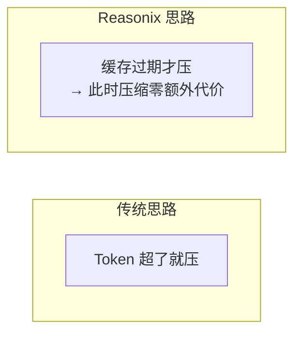
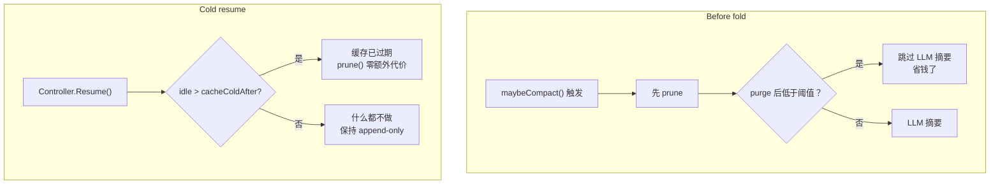

# Reasonix 源码分析

> esengine/DeepSeek-Reasonix · 25K⭐ · Go

---

## 核心设计理念

> "因为缓存命中比未命中便宜 50-120 倍，所以携带死数据在每个 turn 几乎是免费的。真正的伤害集中在**缓存未命中事件**——每次 fold，尤其是每次**冷恢复**，缓存过期的 session 要为整个 prompt 支付全价。"

Reasonix 的压缩不是"更早触发"，而是**在缓存已经凉了的时候，以零额外成本执行压缩**。



---

## 两种触发点



| 触发点 | 时机 | 原理 |
|--------|------|------|
| **Before fold** | `maybeCompact()` 触发时 | 先 prune → 如果 purge 后已低于阈值，跳过付费的 LLM 摘要 |
| **Cold resume** | `Controller.Resume()`，空闲 > `cacheColdAfter` | 缓存已过期 → 重写历史零额外代价，直接缩小首请求 |

---

## Prune 原始语

**文件：** `internal/agent/prune.go`

```
prune():
  输入: messages, protectTail (保护的最近消息数)
  
  1. 找到 prune 边界
     - 从后向前遍历消息
     - 累计 token 数
     - 当 token 数 > protectTail 时停止
  
  2. 对于边界之外的消息：
     - 如果是 tool_result 消息：
       Content → "[Pruned — tool output archived, re-run the command 
                  or re-read the file to restore]"
       原始内容归档（类似 fold 丢弃的消息）
     - 非 tool_result 消息：不碰
  
  3. 保证：
     - 不删除任何消息（tool_calls/tool_call_id 配对永远完整）
     - 不触碰 assistant 消息（含签名的推理保持完整）
     - 纯确定性，零 LLM 调用
```

---

## 实测数据

| 场景 | 结果 |
|------|------|
| 88.7k token session → prune 15 个过期结果 | 23.6k token prompt（**−73%**） |
| warm-cache 惩罚：裁剪仍缓存的 session | 23,598 miss tokens vs 5,900 未裁剪（**约 4×**） |

因此 `cacheColdAfter` 默认为**风险不对称的 24h**——设小了会破坏有效缓存；设大了只是放弃一次无额外成本 prune。

---

## Cold Resume 流程

```
Controller.Resume():
  
  1. 检查 session 是否 idle > cacheColdAfter
  
  2. 如果是：
     - 缓存肯定已过期
     - 运行 prune()（零额外代价——缓存本来就没了）
     - 原子快照（snapshot）裁剪后的 transcript
     - 崩溃恢复：下次 resume 时重放 prune（幂等）
  
  3. 如果不是（warm session）：
     - 什么都不做。history 保持 strict append-only。
```

---

## Placeholder 理解验证

**5/5 通过：** Agent 被问到藏在 prune placeholder 后面的常量值时，每次都**重新 read_file** 拿到准确值——没有幻觉。

---

## 独特亮点

1. **缓存经济学驱动设计** — 不是"什么时候压缩最合理"，而是"什么时候压缩最便宜"
2. **Cold resume prune** — 唯一在 session 恢复时主动压缩的系统
3. **零 LLM 纯确定性裁剪** — prune 不调用任何模型
4. **风险不对称 gate** — `cacheColdAfter: 24h`，宁可不裁剪也不破坏有效缓存

---

## 源码链接

| 文件 | Commit | 关键函数 | 行号 |
|------|--------|---------|------|
| [prune.go](https://github.com/esengine/DeepSeek-Reasonix/blob/main-v2/internal/agent/prune.go) | `main-v2` | `prune()` 确定性工具结果裁剪 | 全文件 |
| [compact.go](https://github.com/esengine/DeepSeek-Reasonix/blob/main-v2/internal/agent/compact.go) | `main-v2` | 压缩摘要 + 机械折叠 fallback | 全文件 |
| [controller.go](https://github.com/esengine/DeepSeek-Reasonix/blob/main-v2/internal/control/controller.go) | `main-v2` | `Controller.Resume()` cold resume 触发点 | 全文件 |
| [PR #3968](https://github.com/esengine/DeepSeek-Reasonix/pull/3968) | 已合并 | prune 原始语完整实现 | — |
| [PR #4138](https://github.com/esengine/DeepSeek-Reasonix/pull/4138) | 已合并 | compaction summary + 机械折叠 fallback | — |

> 仓库：[esengine/DeepSeek-Reasonix](https://github.com/esengine/DeepSeek-Reasonix)
