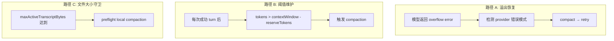
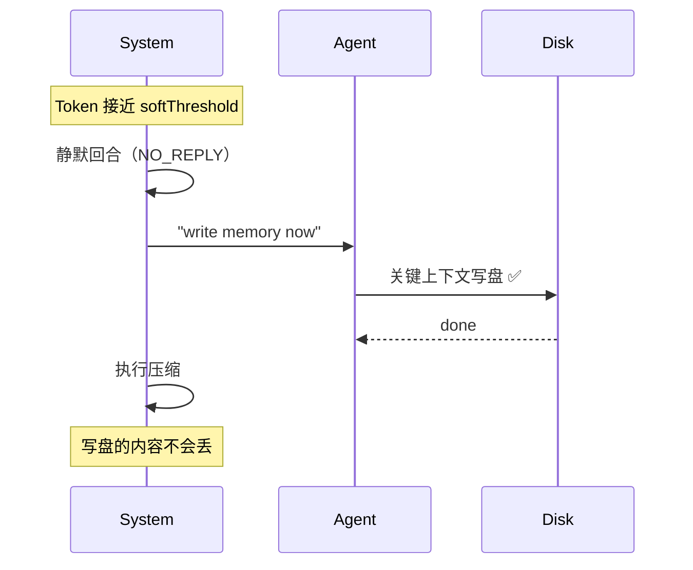
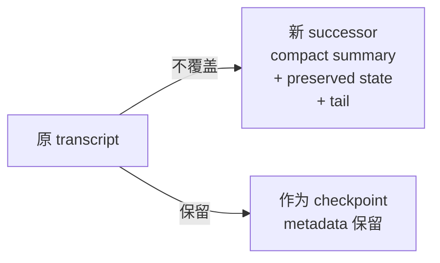

# OpenClaw 源码分析

> openclaw/openclaw · 381K⭐ · TypeScript/Node

---

## 双轨制：Compaction + Pruning

OpenClaw 是唯一将压缩分为**两个独立系统**的：

| 系统 | 做什么 | 持久化 |
|------|--------|--------|
| **Compaction** | LLM 摘要旧对话 | ✅ 写入 transcript (.jsonl) |
| **Pruning** | 裁切旧工具输出 | ❌ 仅内存，每次请求 |

---

## 压缩触发（三种路径）



**Provider 溢出检测模式：**
```
- request_too_large
- context length exceeded
- input exceeds the maximum number of tokens
- input token count exceeds the maximum number of input tokens
- input is too long for the model
- ollama error: context length exceeded
```

---

## 核心机制：压缩前内存冲刷（Memory Flush）

**四个系统中唯一在压缩前主动触发 Agent 写盘的。**



**配置：**
```json
{
  "agents": {
    "defaults": {
      "compaction": {
        "memoryFlush": {
          "enabled": true,
          "model": "ollama/qwen3:8b",
          "softThresholdTokens": 4000,
          "prompt": "...write important notes to memory/..."
        }
      }
    }
  }
}
```

---

## Compaction 模式

| 模式 | 行为 |
|------|------|
| **default** | 标准 LLM 摘要 + 保留最近消息 |
| **safeguard** | 重新蒸馏前序摘要（不保留完整前次摘要原文）+ 质量审计 |

设置为 `provider` 时自动强制 `mode: "safeguard"`。

---

## 工具配对保护

```
如果 token 分割点落在 tool_call 和 tool_result 之间 →
  边界移到 assistant tool-call 消息 →
    不拆分配对
```

Aborted/error tool-call 不阻塞 split。

---

## Successor Transcript 机制

当 `truncateAfterCompaction: true`：



1. 不覆盖原 transcript
2. 创建新 successor transcript
3. 旧 transcript 作为 checkpoint metadata 保留
4. Branch/restore 流向 compacted successor

---

## 可插拔 Compaction Provider

```typescript
// 插件注册
registerCompactionProvider("my-provider", { ... })

// 配置使用
{ "agents": { "defaults": { "compaction": { "provider": "my-provider" } } } }
```

provider 失败 → 自动 fallback 到内置 LLM 摘要。

---

## 独特亮点

1. **Memory Flush** — 四个系统中唯一在压缩前主动触发 Agent 写盘的
2. **双轨压缩+裁切** — compaction 持久化，pruning 临时
3. **三路径触发** — 溢出恢复 + 阈值维护 + 文件大小守卫
4. **Successor transcript** — 压缩不覆盖原文件，创建新 successor
5. **midTurnPrecheck** — 工具循环中也可触发压缩（opt-in）

---

## 源码链接

| 文件 | 说明 |
|------|------|
| [src/agent/compaction.ts](https://github.com/openclaw/openclaw/blob/main/src/agent/compaction.ts) | 压缩主逻辑 |
| [src/agent/pruning.ts](https://github.com/openclaw/openclaw/blob/main/src/agent/pruning.ts) | Pruning 独立系统 |
| [src/agent/overflow.ts](https://github.com/openclaw/openclaw/blob/main/src/agent/overflow.ts) | 溢出检测与恢复 |

> 仓库：[openclaw/openclaw](https://github.com/openclaw/openclaw)
