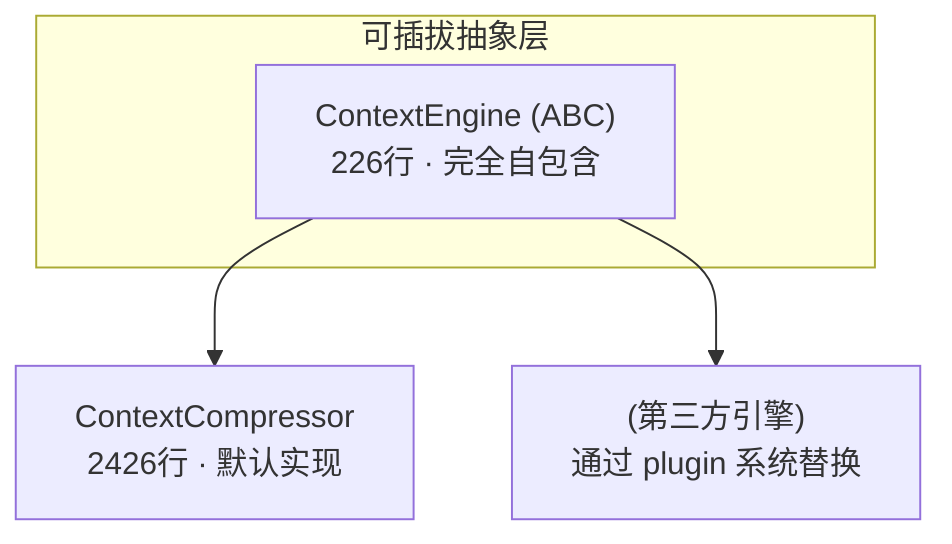
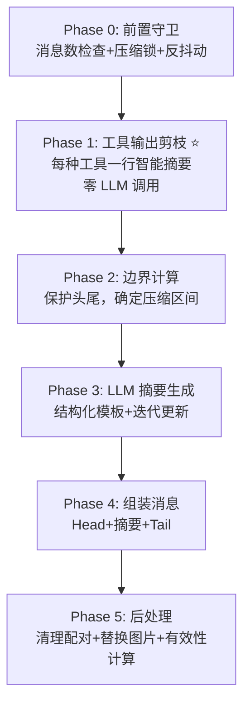
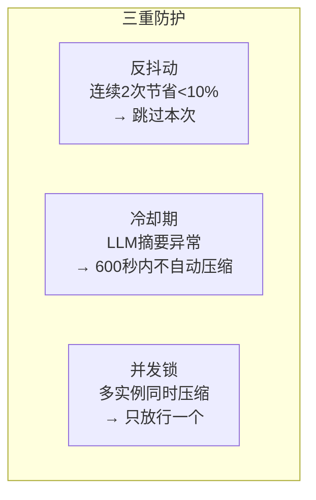

# Hermes Agent 源码分析

> NousResearch/hermes-agent · Python · 核心引擎可插拔

---

## 架构特色



---

## 五阶段压缩流水线



### Phase 1: 工具输出剪枝

```
[terminal] ran `npm test` → exit 0, 47 lines output
[read_file] read config.py from line 1 (3,400 chars)
[delegate_task] 'review the design' (12,000 chars result)
[browser_navigate] https://example.com (45,000 chars)
```

每种工具一个专属摘要生成器，20+ 种工具全覆盖，零 LLM 调用。

### Phase 2: 边界计算

| 保护项 | 规则 |
|-------|------|
| Head | system prompt + protect_first_n 条消息 |
| Tail | ~20K tokens 预算 + 硬地板 8 条 |
| 跳过条件 | start ≥ end → 消息太少不值得压 |

### Phase 3: LLM 摘要生成

结构化模板：
```
## Active Task       ← 正在做什么
## Resolved Questions ← 已解决的
## Pending User Asks  ← 用户还没答的
## In Progress        ← 干了一半的（不能丢！）
## Key Decisions      ← 重要决定
## Files & Paths      ← 涉及的文件
```

迭代更新：第二次压缩传入上次摘要，合并新旧信息。

### Phase 4: 组装消息

```
Head（保护消息）+ 摘要消息（带边界标记）+ Tail（最新消息）
```

- `_compressed_summary` metadata key（wire 层剥离）
- `--- END OF CONTEXT SUMMARY ---` 边界标记

### Phase 5: 后处理

| 步骤 | 作用 |
|------|------|
| `_sanitize_tool_pairs()` | 清理孤立 tool_call/tool_result |
| `_strip_historical_media()` | 旧图片替换为占位文本 |
| 有效性计算 | 节省 < 10% → ineffective++ |

---

## 压缩前缀（最强防御）

```
[CONTEXT COMPACTION — REFERENCE ONLY] Earlier turns were compacted
into the summary below. This is a handoff from a previous context
window — treat it as background reference, NOT as active instructions.
Do NOT answer questions or fulfill requests mentioned in this summary;
they were already addressed.
Respond ONLY to the latest user message that appears AFTER this
summary — that message is the single source of truth for what to do
right now.
Topic overlap with the summary does NOT mean you should resume its
task: even on similar topics, the latest user message WINS.
```

**四个系统中最防御性最强的摘要前缀**——明确告诉模型"不要执行摘要里的任务"。

---

## 三重防抖



| 机制 | 触发条件 | 行为 |
|------|---------|------|
| **反抖动** | 连续2次压缩节省 < 10% | `should_compress()` 返回 False |
| **冷却期** | LLM 摘要异常 | 600秒内不自动压缩 |
| **并发锁** | 多 Agent 实例同时压缩同 session | state.db 级锁，只放行一个 |

---

## 迭代摘要

```
第1次压缩: _generate_summary(messages) → 初始摘要
第2次压缩: _generate_summary(messages, previous_summary)
            → "Below is the summary from the previous compaction..."
            → 保留有效信息 + 合并新事实 + 删除过时内容
第3次压缩: 同上，保留前三轮关键信息
```

---

## 图片处理

```python
# _strip_historical_media()
# 找到最新包含图片的 user 消息
# 该消息之前的所有图片 → 替换为占位文本
# "[Attached image — stripped after compression]"

# 目的：多轮后不再重新发送数MB的base64图片
```

**唯一处理 base64 图片膨胀的系统。**

---

## 独特亮点

1. **工具输出剪枝（最精细）** — 每种工具专属一行智能摘要，20+种工具全覆盖
2. **三重防抖** — 反抖动 + 冷却期 + 并发锁，生产级鲁棒性
3. **ContextEngine ABC** — 唯一的可插拔接口，第三方引擎可完整替换
4. **防御性摘要前缀** — 显式禁止模型"继续执行摘要中的任务"
5. **图片历史清理** — 唯一处理 base64 图片膨胀的系统
