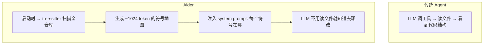
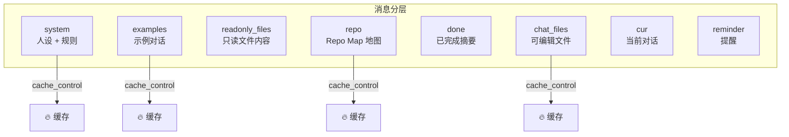

# Aider 上下文管理分析

> Aider-AI/aider · Python · "先画地图再干活"

---

## 核心文件

| 文件 | 作用 |
|------|------|
| [repomap.py](https://github.com/Aider-AI/aider/blob/main/aider/repomap.py) (867行) | Repo Map 生成引擎（tree-sitter 代码图谱） |
| [chat_chunks.py](https://github.com/Aider-AI/aider/blob/main/aider/coders/chat_chunks.py) (64行) | 结构化消息分层 + 缓存控制 |
| [base_coder.py](https://github.com/Aider-AI/aider/blob/main/aider/coders/base_coder.py) | 上下文预算管理与耗尽检测 |

---

## 独门绝技：Repo Map（代码库地图）

Aider 不压缩对话——它在对话**开始前**就把代码库结构注入上下文。

**Repo Map 做什么：** 用 tree-sitter 解析整个代码库的 AST，生成一张"地图"——每个类/函数/变量的位置。LLM 看到地图就知道 `Config` 类在 `src/config.py:42`，不需要先读文件。

配置：`map_tokens=1024` 默认，可通过 `--map-tokens` 调整。

---

## ChatChunks：八层消息结构

Aider 把消息分成 8 个独立层，每层有不同的缓存策略：

**关键设计：**
- `system` + `examples` 层 → 整个会话不变 → 标记为 prompt cache
- `repo` 层 → 文件未修改时不变 → 也标记为 cache
- `cur` 层 → 每次都在变 → 不缓存
- 通过 Anthropic 的 `ephemeral` cache_control 标记，缓存命中时节省大量 token 开销

---

## 上下文耗尽处理

Aider 不做传统"压缩"。当上下文耗尽时：

1. `num_exhausted_context_windows` 计数器累加
2. 检测到 `max_input_tokens` 超限 → 警告用户
3. 提供建议：减少 chat files、增大 map_tokens、使用 `/drop` 清除历史
4. 核心策略：**预防胜于治疗**——Repo Map 让 LLM 少调工具，从根本上减少上下文消耗

---

## 独特亮点

1. **Repo Map** — 六个系统中唯一在对话前注入代码库结构图谱的
2. **ChatChunks 分层** — 结构化消息分层 + prompt cache 优化
3. **预防式上下文管理** — 不让上下文涨起来，而非涨起来再压
4. **不依赖 LLM 摘要** — 不做对话压缩，靠地图减少工具调用频率

---

## 源码链接

| 文件 | 关键函数/段 | 行号 |
|------|-----------|------|
| [repomap.py](https://github.com/Aider-AI/aider/blob/main/aider/repomap.py) | `RepoMap.__init__()` 地图引擎入口 | [L42](https://github.com/Aider-AI/aider/blob/main/aider/repomap.py#L42) |
| 同上 | `get_repo_map()` 生成地图 | 全文件 |
| [chat_chunks.py](https://github.com/Aider-AI/aider/blob/main/aider/coders/chat_chunks.py) | `ChatChunks` 八层结构定义 | [L6](https://github.com/Aider-AI/aider/blob/main/aider/coders/chat_chunks.py#L6) |
| 同上 | `add_cache_control_headers()` 缓存标记 | [L28](https://github.com/Aider-AI/aider/blob/main/aider/coders/chat_chunks.py#L28) |
| [base_coder.py](https://github.com/Aider-AI/aider/blob/main/aider/coders/base_coder.py) | `num_exhausted_context_windows` 耗尽计数 | [L97](https://github.com/Aider-AI/aider/blob/main/aider/coders/base_coder.py#L97) |
| 同上 | `send_message()` 上下文超限检测 | [L1419](https://github.com/Aider-AI/aider/blob/main/aider/coders/base_coder.py#L1419) |

> 仓库：[Aider-AI/aider](https://github.com/Aider-AI/aider)
