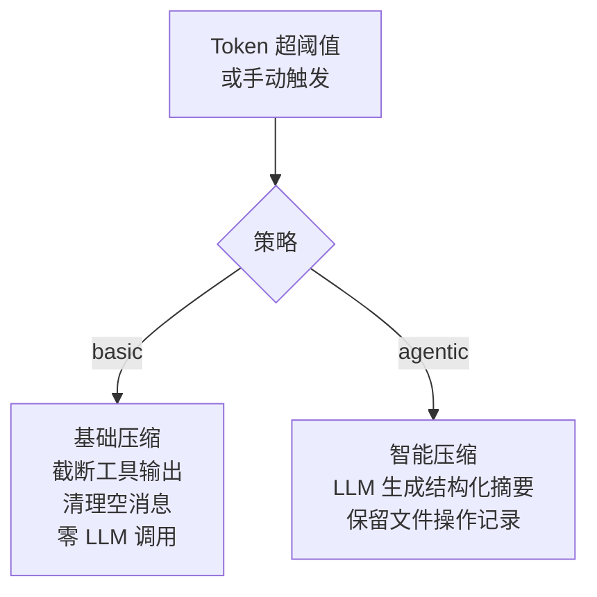
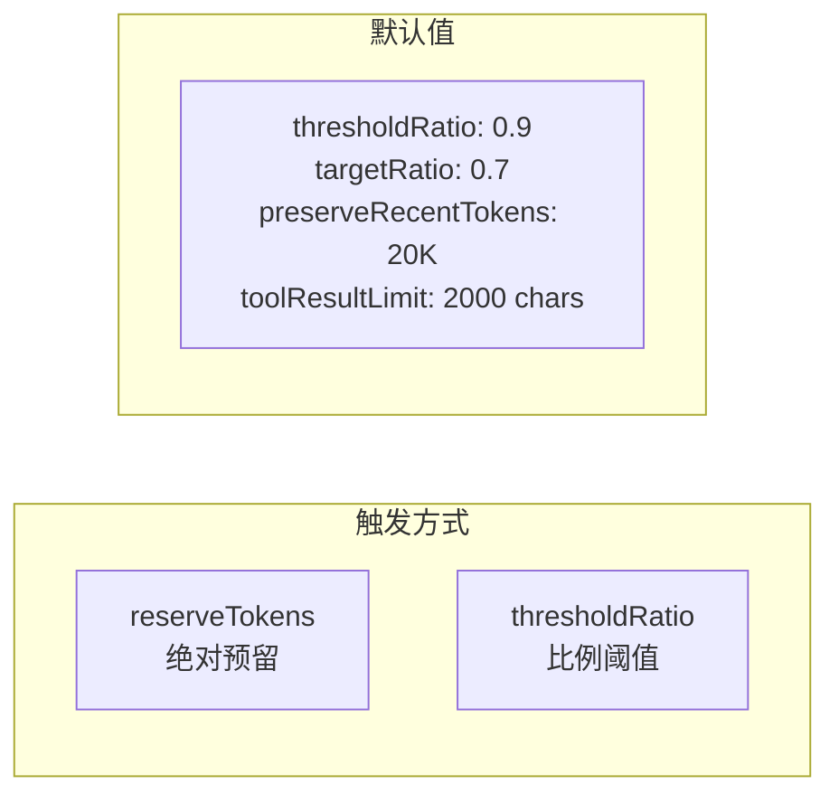

# Cline 上下文压缩分析

> cline/cline · TypeScript · 双策略压缩引擎

---

## 核心文件

| 文件 | 作用 |
|------|------|
| [compaction.ts](https://github.com/cline/cline/blob/main/sdk/packages/core/src/extensions/context/compaction.ts) (486行) | 压缩编排 + 触发判断 |
| [basic-compaction.ts](https://github.com/cline/cline/blob/main/sdk/packages/core/src/extensions/context/basic-compaction.ts) (458行) | 基础压缩：截断 + 清理 |
| [agentic-compaction.ts](https://github.com/cline/cline/blob/main/sdk/packages/core/src/extensions/context/agentic-compaction.ts) (153行) | 智能压缩：LLM 摘要 |
| [compaction-shared.ts](https://github.com/cline/cline/blob/main/sdk/packages/core/src/extensions/context/compaction-shared.ts) (516行) | 共享工具 + 常量 |

---

## 双策略压缩

Cline 是六个系统中唯一提供**两种可切换压缩策略**的：



| 策略 | 方式 | LLM 调用 | 适用 |
|------|------|---------|------|
| `basic` | 截断工具结果 2000 字符 + 清理空消息 | ❌ 零调用 | 快速压缩 |
| `agentic` | 独立模型生成摘要（含文件操作记录） | ✅ 一次调用 | 需要保留语义 |

---

## 触发与参数



**触发逻辑（`resolveTriggerState`）：**
- 如果配置了 `reserveTokens` → `inputTokens > maxInputTokens - reserveTokens` 就触发
- 否则按 `thresholdRatio` → 默认 90% 上下文窗口就触发
- 手动触发：`/compact` 命令

---

## Basic Compaction 流程

```
1. sanitize → 去除非文本块、清理空消息、移除旧的 compaction summary
2. truncate → 工具结果截断到 2000 字符
   - 文本块: "text" → 截断
   - 文件块: <file path="...">content</file> → 截断
   - 图片块: "[image:mediaType]" → 保留占位
3. find cut index → 从后向前累积 token 预算
4. 保护 tool_call/tool_result 配对完整性
5. 返回压缩后消息列表
```

---

## Agentic Compaction 流程

```
1. serializeConversation → 将对话序列化成文本
2. extractFileOps → 提取文件操作（读/改/删）
3. buildSummaryRequest → 构造摘要 prompt
4. generateSummary → 调用独立模型生成摘要
5. buildSummaryMessage → 创建 CompactionSummaryMetadata 消息
   { kind: "compaction_summary", summary, details, tokensBefore }
6. 插入到对话中
```

---

## 工具结果截断

```typescript
// DEFAULT 常量
TOOL_RESULT_CHAR_LIMIT = 2000       // 工具输出截断到 2000 字符
FILE_CONTENT_CHAR_LIMIT = 2000      // 文件内容也限 2000 字符
MIN_TRUNCATED_MESSAGE_TOKENS = 8    // 低于 8 token 的消息直接丢弃
```

---

## 独特亮点

1. **双策略可切换** — basic（零 LLM）vs agentic（LLM 摘要），六个系统中唯一
2. **结构化摘要元数据** — `CompactionSummaryMetadata` 包含文件操作详情
3. **工具输出截断** — 2000 字符硬限制，basic 策略下有专门的 truncate 模块
4. **摘要迭代** — `findLatestSummaryIndex` 找到上次摘要并合并
5. **可配置触发** — reserveTokens 或 thresholdRatio 两种模式

---

## 源码链接

| 文件 | 关键函数 | 行号 |
|------|---------|------|
| [compaction.ts](https://github.com/cline/cline/blob/main/sdk/packages/core/src/extensions/context/compaction.ts) | `resolveTriggerState()` 触发判断 | [L176](https://github.com/cline/cline/blob/main/sdk/packages/core/src/extensions/context/compaction.ts#L176) |
| 同上 | `BUILTIN_COMPACTION_STRATEGIES` 双策略注册 | [L143](https://github.com/cline/cline/blob/main/sdk/packages/core/src/extensions/context/compaction.ts#L143) |
| [agentic-compaction.ts](https://github.com/cline/cline/blob/main/sdk/packages/core/src/extensions/context/agentic-compaction.ts) | `generateSummary()` LLM 摘要生成 | [L23](https://github.com/cline/cline/blob/main/sdk/packages/core/src/extensions/context/agentic-compaction.ts#L23) |
| [basic-compaction.ts](https://github.com/cline/cline/blob/main/sdk/packages/core/src/extensions/context/basic-compaction.ts) | `sanitizeMessageForBasic()` 消息清理 | [L37](https://github.com/cline/cline/blob/main/sdk/packages/core/src/extensions/context/basic-compaction.ts#L37) |
| [compaction-shared.ts](https://github.com/cline/cline/blob/main/sdk/packages/core/src/extensions/context/compaction-shared.ts) | DEFAULT 常量 | [L16](https://github.com/cline/cline/blob/main/sdk/packages/core/src/extensions/context/compaction-shared.ts#L16) |
| 同上 | `truncateToolResultContentForCompaction()` 截断 | [L71](https://github.com/cline/cline/blob/main/sdk/packages/core/src/extensions/context/compaction-shared.ts#L71) |

> 仓库：[cline/cline](https://github.com/cline/cline)
