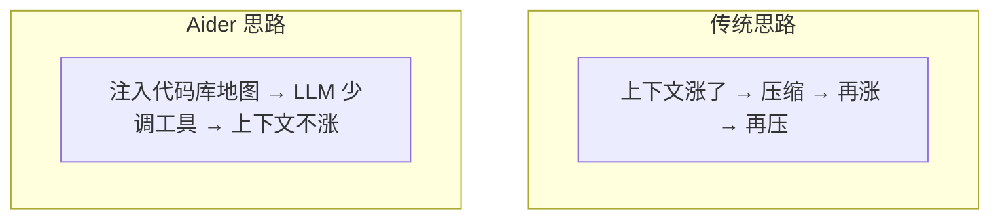
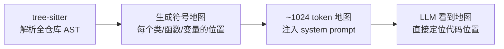
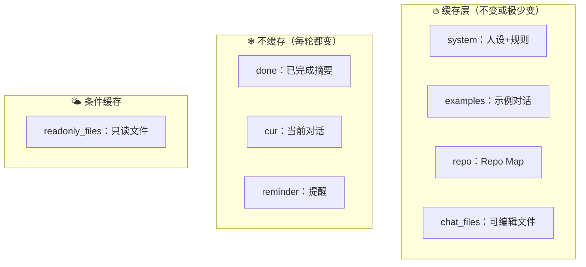

# Aider 上下文管理流程

> Repo Map：不让上下文涨起来的预防式策略

---

## 核心理念

Aider **不压缩对话**。它在对话开始前就注入代码库地图，让 LLM 少调工具，**从根本上减少上下文消耗**。

---

## Repo Map 生成流程

**效果：** LLM 不用 `read_file` 探索代码结构，知道 `Config` 类在 `src/config.py:42`，直接去改。

---

## ChatChunks 八层消息结构

每层独立的 `cache_control` 标记，利用 prompt cache 优化。

---

## 上下文耗尽处理

不是"压缩"，而是**告警 + 建议**：

1. 检测 `max_input_tokens` 超限
2. `num_exhausted_context_windows++` 计数
3. 警告用户：模型 token 限制已达
4. 建议：减少 chat files、增大 map_tokens、`/drop` 清除历史

---

## 关键参数

| 参数 | 默认值 | 说明 |
|------|--------|------|
| `map_tokens` | 1024 | Repo Map 占用 token 数 |
| `map_mul_no_files` | 8 | 文件数 × 此值影响 map 大小 |

---

## 独特设计

- **Repo Map**：唯一在对话前注入代码库结构图谱
- **预防式管理**：不让上下文涨起来
- **ChatChunks 分层**：结构化消息 + prompt cache 优化
- **不依赖 LLM 摘要**：不压缩对话，靠地图减少工具调用
