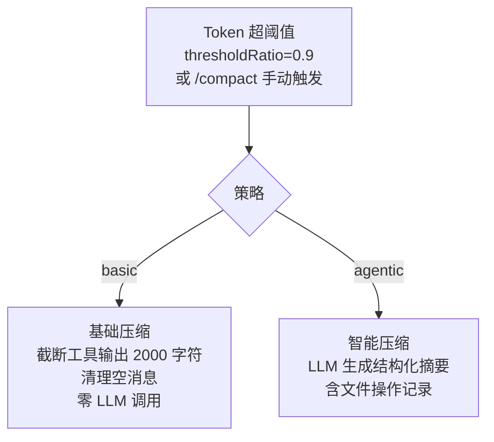

# Cline 压缩流程

> 双策略压缩引擎：basic 截断 + agentic 摘要

---

## 双策略架构



---

## Basic Compaction 流程

```
1. sanitize
   ├─ 去除非文本块
   ├─ 清理空消息（< 8 token）
   └─ 移除旧的 compaction summary

2. truncate
   ├─ 工具结果截断到 2000 字符
   ├─ 文件块: <file path="...">content</file> → 截断
   └─ 图片块: "[image:mediaType]" → 保留占位

3. find cut index
   └─ 从后向前累积 token 预算

4. 保护配对
   └─ tool_call/tool_result 不拆分

5. 返回压缩后消息列表
```

---

## Agentic Compaction 流程

```
1. serializeConversation
   └─ 对话序列化为文本

2. extractFileOps
   └─ 提取文件操作（读/改/删）

3. buildSummaryRequest
   └─ 构造摘要 prompt

4. generateSummary
   └─ 调用独立模型生成摘要

5. buildSummaryMessage
   └─ 创建 CompactionSummaryMetadata
      { kind, summary, details, tokensBefore }

6. 插入到对话中
```

---

## 触发机制

```typescript
// 两种触发模式（二选一）

// 模式 1: 绝对预留
reserveTokens: 16384  // 给输出留 16K token
→ inputTokens > maxInputTokens - 16384 时触发

// 模式 2: 比例阈值（默认）
thresholdRatio: 0.9  // 用到 90% 就触发
targetRatio: 0.7     // 压缩到 70%
```

---

## 关键参数

| 参数 | 默认值 | 说明 |
|------|--------|------|
| `thresholdRatio` | 0.9 | 触发阈值 |
| `targetRatio` | 0.7 | 压缩目标 |
| `preserveRecentTokens` | 20,000 | 保留最近上下文 |
| `TOOL_RESULT_CHAR_LIMIT` | 2,000 | 工具输出截断上限 |
| `FILE_CONTENT_CHAR_LIMIT` | 2,000 | 文件内容截断上限 |
| `MIN_TRUNCATED_MESSAGE_TOKENS` | 8 | 低于此值的消息丢弃 |
| `SUMMARY_MAX_OUTPUT_TOKENS` | 1,024 | 摘要最大输出 |

---

## 独特设计

- **双策略可切换**：六个系统中唯一提供两种压缩策略
- **结构化摘要元数据**：CompactionSummaryMetadata 含文件操作详情
- **逐块截断**：文本/文件/图片各有专门截断逻辑
- **可配置触发**：reserveTokens 或 thresholdRatio 二选一
