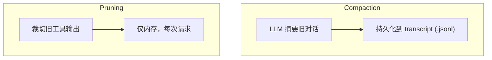
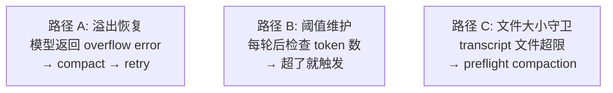
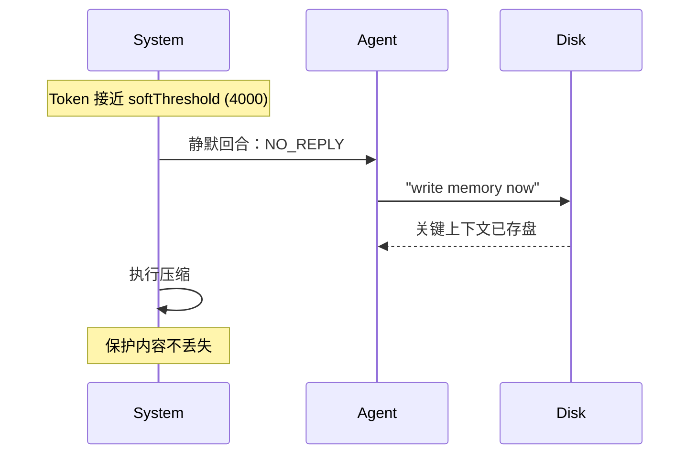

# OpenClaw 压缩流程

> 双轨制 + 压缩前内存冲刷

---

## 双轨架构



---

## 三种触发路径



---

## 压缩前内存冲刷（Memory Flush）



**六个系统中唯一在压缩前主动触发 Agent 写盘的。**

---

## 压缩模式

| 模式 | 行为 |
|------|------|
| **default** | 标准 LLM 摘要 + 保留最近消息 |
| **safeguard** | 重新蒸馏前序摘要 + 质量审计 |

---

## Compaction 流程

```
1. 检测触发（溢出/阈值/文件守卫）
2. (可选) Memory Flush — 静默写盘
3. splitMessagesByTokenShare() — token 分片
4. chunkMessagesByMaxTokens() — 按上限分块
5. summarizeChunks() — 逐块摘要（重试3次）
6. summarizeWithFallback() — 渐进降级
7. summarizeInStages() — 多段摘要合并
8. 组装：summary + preserved state + tail
```

---

## 关键参数

| 参数 | 默认值 |
|------|--------|
| BASE_CHUNK_RATIO | 0.4 |
| SAFETY_MARGIN | 1.2 |
| softThresholdTokens | 4000 |
| summarizeChunks 重试 | 3 次 |

---

## 独特设计

- **Memory Flush**：唯一压缩前主动写盘
- **双轨制**：Compaction + Pruning 独立运行
- **三路径触发**：溢出 / 阈值 / 文件大小
- **Successor transcript**：压缩不覆盖原文件
- **可插拔 Provider**：支持注册自定义压缩策略
