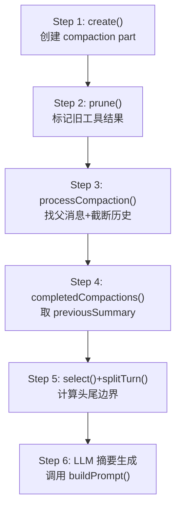
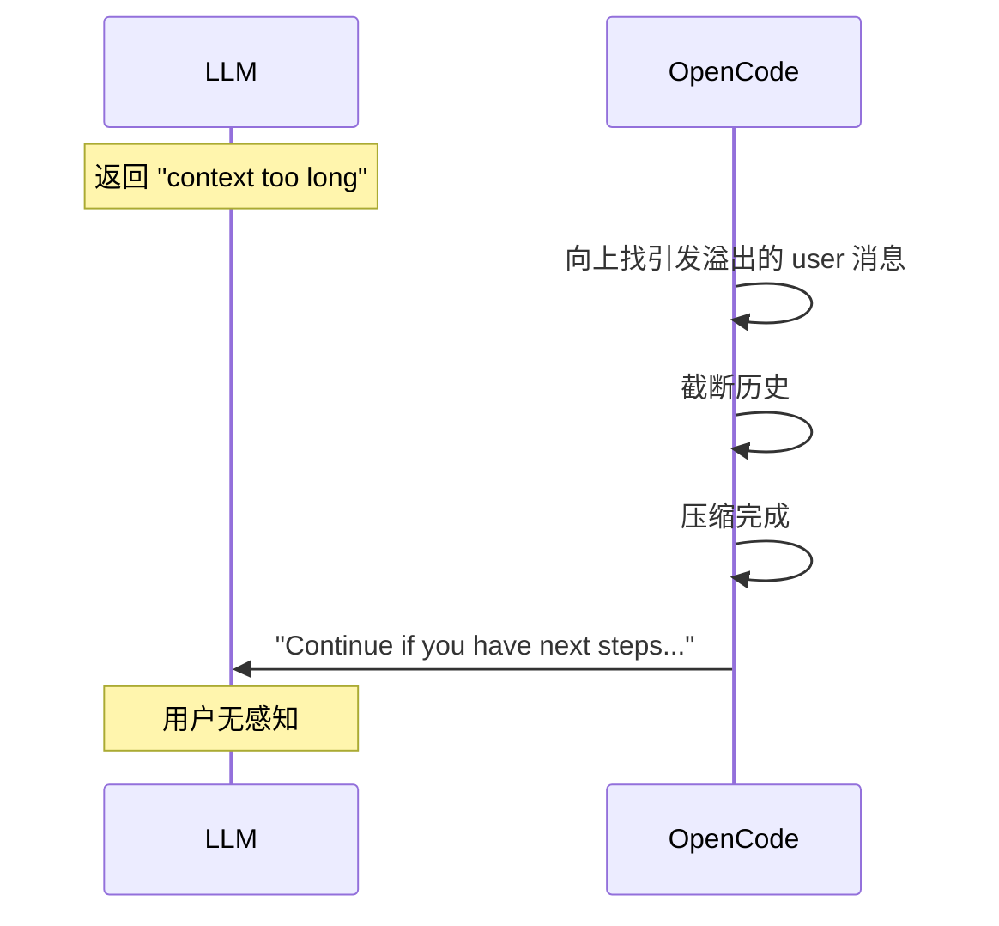

# OpenCode 压缩流程

> 6 步压缩 + 溢出自动恢复

---

## 总流程

---

## 各步骤

| 步骤 | 做什么 | 关键参数 |
|------|--------|---------|
| **1. create** | 创建 compaction part，标记 auto/overflow | — |
| **2. prune** | 标记旧工具结果 `part.state.time.compacted = Date.now()` | PRUNE_PROTECT=40K, PRUNE_MINIMUM=20K |
| **3. processCompaction** | overflow 时截断历史到上一个普通 user 消息 | — |
| **4. completedCompactions** | 提取上一次压缩的锚定摘要 | — |
| **5. select + splitTurn** | tail_turns(默认2) 累积 token 预算 | preserve_recent_tokens = min(8000, max(2000, usable×25%)) |
| **6. LLM 摘要** | 调用 buildPrompt() 生成锚定摘要 | 失败且 auto=true → 自动继续 |

---

## 触发机制

硬编码 **75% 上下文窗口**触发。社区 issue #11314 要求可配置化。

---

## 溢出自动恢复

---

## 独特设计

- **锚定摘要**：不是重新生成，而是更新已有摘要
- **auto-replay**：溢出后自动恢复对话
- **时间戳标记**：用 `Date.now()` 标记而非删除消息
