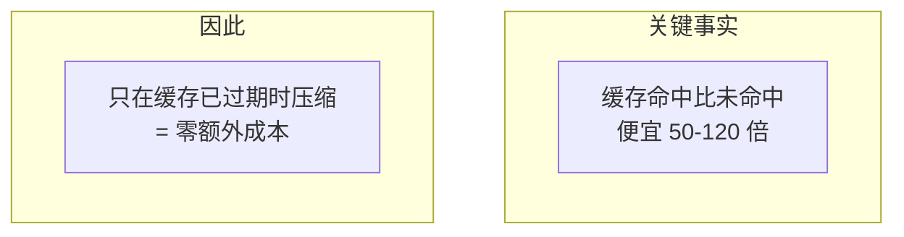
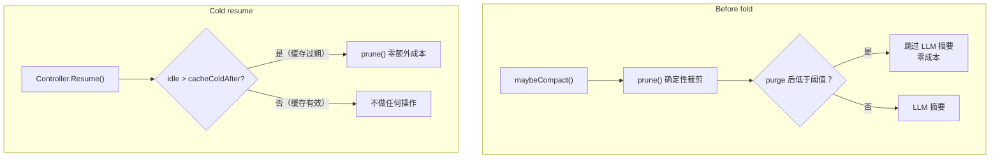

# Reasonix 压缩流程

> 缓存经济学驱动的确定性裁剪

---

## 核心理念

**不是"什么时候压缩最合理"，而是"什么时候压缩最便宜"。**



---

## 两种触发



---

## Prune 流程

```
1. 从后向前遍历消息，累计 token
2. 超过 protectTail 的消息：
   - tool_result → "[Pruned — tool output archived, re-run to restore]"
   - 非 tool_result → 不碰
3. 保证：
   - 不删除任何消息（tool_call/tool_call_id 配对完整）
   - 不触碰 assistant 消息
   - 纯确定性，零 LLM 调用
```

---

## 关键参数

| 参数 | 默认值 | 原因 |
|------|--------|------|
| `cacheColdAfter` | **24h** | 风险不对称：设小了烧缓存，设大了只是错过一次免费裁剪 |
| `protectTail` | 最近消息 | 保护尾部上下文 |

---

## 实测数据

| 场景 | 结果 |
|------|------|
| 88.7K token session → prune 15 个过期结果 | 23.6K prompt（**−73%**） |
| 热缓存惩罚（错误触发裁剪） | 23,598 miss vs 5,900 未裁剪（**4×**） |

---

## 独特设计

- **缓存经济学**：唯一围绕缓存命中率设计的压缩策略
- **Cold Resume**：唯一在 session 恢复时主动压缩
- **零 LLM 裁剪**：prune 不调用任何模型
- **Placeholder 验证**：5/5 测试通过，Agent 能识别 placeholder 并重新读取
