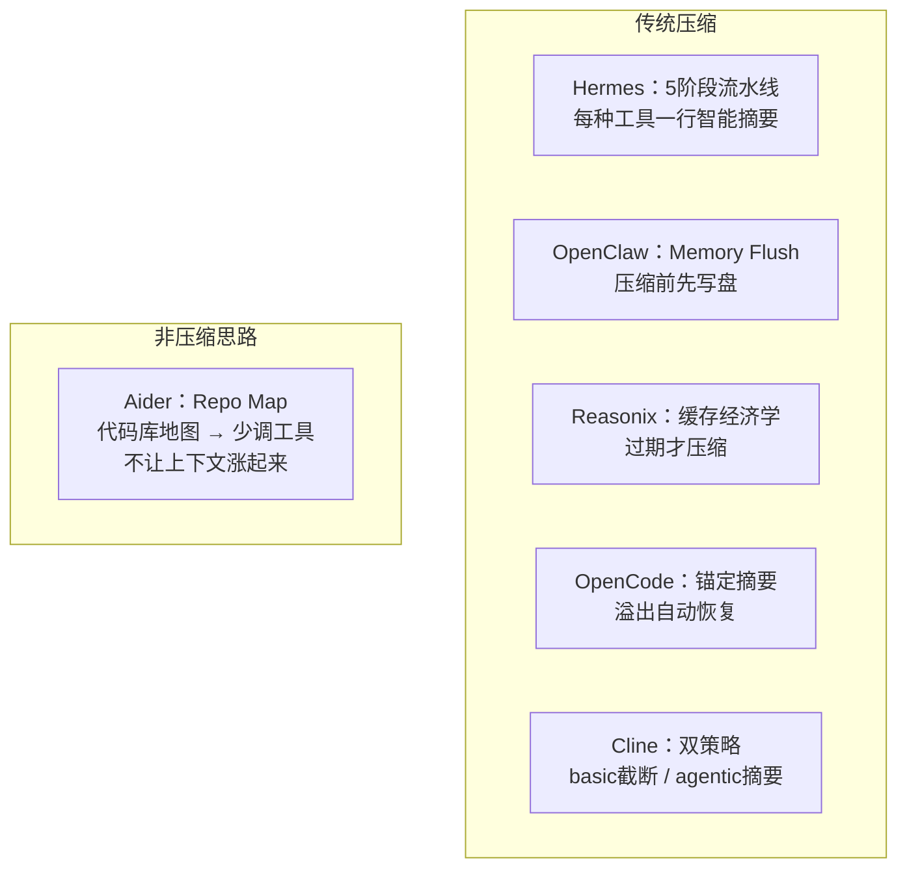

# 上下文压缩 — 总览

> 六大主流 AI Agent 上下文管理机制深度对比 — Hermes · OpenClaw · Reasonix · OpenCode · Aider · Cline

---

## 一句话

**上下文压缩 = 对话太长放不下 → 把已经干完的事总结成一段摘要 → 腾出空间继续干活。**

---

## 六个系统怎么做的（一张图）

---

## 六系统核心差异（一张表）

| 系统 | 思路 | 核心手段 | 最独特的设计 |
|------|------|---------|------------|
| **Hermes** | 压缩 | 5 阶段流水线 | 每种工具一行智能摘要（零 LLM） |
| **OpenClaw** | 压缩 | LLM 摘要 + 独立裁切 | **压缩前内存冲刷**（先写盘再压） |
| **Reasonix** | 压缩 | 确定性裁剪 | **缓存经济学驱动**——只在缓存过期才动 |
| **OpenCode** | 压缩 | 锚定摘要更新 | auto-replay：溢出后自动恢复对话 |
| **Cline** | 压缩 | **双策略**（basic/agentic 可切换） | 截断 + LLM 摘要两种模式 |
| **Aider** | ⭐ **预防** | Repo Map 代码库地图 | **不让上下文涨起来**——注入地图减少工具调用 |

---

## 快速导航

| 你想看什么 | 去哪个文件 |
|-----------|-----------|
| Hermes 压缩怎么一步步做的 | [`flow/hermes.md`](./flow/hermes.md) |
| 六个系统挨个对比 | [`comparison.md`](./comparison.md) |
| 哪些设计可以借鉴复用 | [`patterns.md`](./patterns.md) |
| Aider：代码库地图 + 分层缓存 | [`flow/aider.md`](./flow/aider.md) |
| Cline：双策略压缩引擎 | [`flow/cline.md`](./flow/cline.md) |

---

## 一句话记住六个系统

> **Aider** 不让涨 · **Cline** 双模切 · **Hermes** 剪最细 · **OpenClaw** 护最全 · **Reasonix** 算最精 · **OpenCode** 恢复最稳
